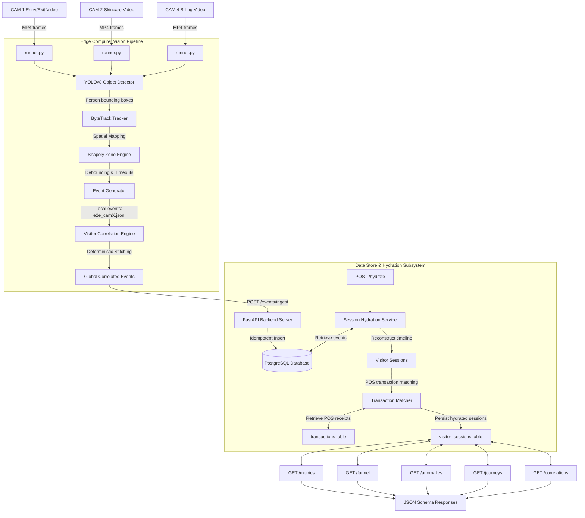
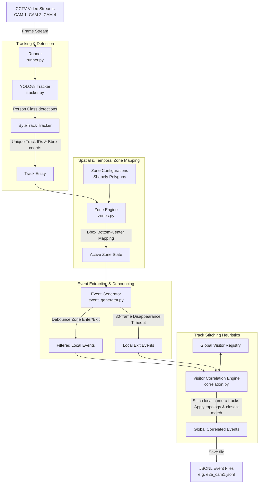
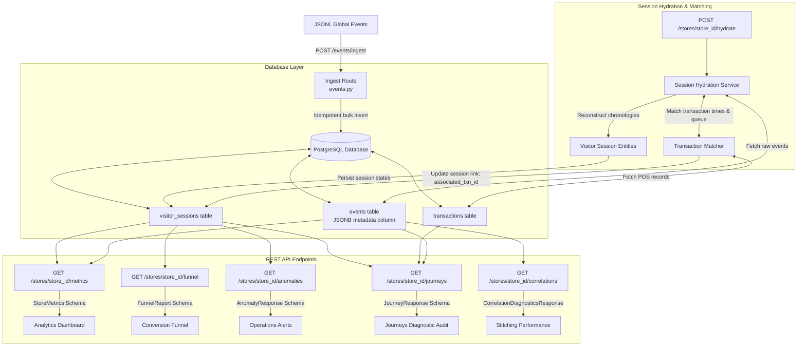

# Platform Architecture & Design Document

This document describes the architectural layout and system design of the **Retail Intelligence Platform**, separating the edge-based **Computer Vision Detection Pipeline** from the cloud-based **Backend Analytics Pipeline**.

---

## 1. Problem Statement

Physical retail stores lack the rich behavioral analytics (such as conversion funnels, dwell times, and bounce rates) available to online e-commerce platforms. 
This platform bridges that gap by transforming raw, unstructured video streams into structured business intelligence:
$$\text{Raw CCTV Video Streams} \to \text{CV Track Detections} \to \text{Stitched Events} \to \text{Hydrated Sessions} \to \text{POS-Attributed Metrics}$$

Key challenges addressed:
* **Session Fragmentation**: A single visitor triggers multiple local tracking IDs as they move out of view of one camera and enter another.
* **Transaction Linking**: Point-of-Sale (POS) purchases must be correlated back to physical store journeys without personal identifiers (PII).
* **Operational Anomalies**: Real-time identification of queue spikes, sudden conversion drops, and retail zone inactivity.

---

## 2. System Architecture

The architecture separates edge-based computer vision event extraction from backend database hydration and REST API serving.

---

## 3. Data Flow Lifecycle

1. **Detection & Tracking**: A visitor is detected by YOLOv8 on `CAM1` and assigned a local track ID. Bounding boxes are tracked frame-to-frame.
2. **Spatial Mapping**: The `ZoneEngine` maps the bottom-center of the visitor's bounding box onto Shapely polygon coordinates.
3. **Event Extraction**: An `ENTRY` event is emitted. The system debounces the track across zone boundaries (requires 10 consecutive frames inside a polygon). When track loss occurs for 30 consecutive frames, an `EXIT` event is emitted.
4. **Stitching (Cross-Camera Correlation)**: Raw camera-local files are combined. The `VisitorCorrelationEngine` matches the exit on `CAM1` to an enter on `CAM2` within 30 seconds, maintaining a global identifier (e.g. `VIS_G001`).
5. **Ingestion**: Stitched events are POSTed to `/events/ingest` and written to the database. The original camera and track IDs are stored in a JSONB `metadata` column.
6. **Hydration**: The `SessionHydrationService` groups database events by global visitor ID, calculates dwell times, and creates a `VisitorSession` record.
7. **Attribution**: The `TransactionMatcher` evaluates proximity between checkout queue enter/dwell times and POS transactions, linking the `transaction_id` to the session.
8. **Serving**: API endpoints query the sessions and transactions tables to compute metrics, conversion rates, and anomalies.

---

## 4. Computer Vision Edge Pipeline

The computer vision pipeline processes CCTV footage frame-by-frame, performs tracking, maps coordinates to retail zone polygons, and correlates tracks across cameras to produce stitched, global retail events.

### Components:
* **YOLOv8 & ByteTrack**: Fast, edge-based object tracking. Maps pixel coordinates of visitors and tracks them across frames.
* **Zone Engine (Shapely)**: Translates bounding box bottom-center coordinates into logical regions (Skincare aisle, Entry/Exit corridor, Billing counter queue) using geometric intersection.
* **Event Generator State Machine**: Bypasses frame noise by requiring a visitor to dwell inside a polygon for 10 frames before entering, and emits exits after 30 consecutive frames of track loss.
* **Visitor Correlation Engine**: Runs post-processing track stitching. Links tracks from CAM1 exit to CAM2 entry, and CAM2 aisle to CAM4 billing counter. Enforces store topology limits.

---

## 5. Backend Analytics Pipeline

The backend ingestion pipeline receives correlated events, stores them, aggregates them into customer sessions, attributes POS transactions, and exposes analytic API routes.

### Components:
* **JSONB Metadata Persistence**: Preserves the original `track_id`, `camera_id`, and `correlation_confidence` directly in the events record, bypassing database schema updates.
* **Session Hydration Service**: Batches individual enter/dwell/exit events into unified visitor session records (e.g. `VIS_G001` visited entry $\to$ skincare $\to$ billing counter).
* **Transaction Matcher**: Resolves session-transaction pairs. Scores matches based on timestamps and queue presence.
* **Analytics/Diagnostics API Engine**: Converts sessions and transactions into actionable store intelligence (metrics, conversion rates, queue warnings, and journey cohort analysis).

---

## 6. Database Schema Design

The schema is built for PostgreSQL using SQLAlchemy.

### A. `Event` Model (`events` table)
* `event_id` (UUID, Primary Key, Indexed)
* `store_id` (String(50), Indexed, Non-Nullable)
* `camera_id` (String(100), Nullable)
* `visitor_id` (String(50), Indexed, Nullable) - Stitched global ID.
* `event_type` (Enum: ENTRY, EXIT, ZONE_ENTER, ZONE_EXIT, ZONE_DWELL, BILLING_QUEUE_JOIN, BILLING_QUEUE_EXIT)
* `timestamp` (DateTime with Timezone, Indexed, Non-Nullable)
* `zone_id` (String(100), Indexed, Nullable)
* `dwell_ms` (Integer, Nullable)
* `is_staff` (Boolean, Default False)
* `confidence` (Float, Default 1.0)
* `metadata` (JSONB, Nullable) - Stores original camera tracking metadata (`original_track_id`, `original_camera_id`, `correlation_confidence`).

### B. `VisitorSession` Model (`visitor_sessions` table)
* `session_id` (UUID, Primary Key, Indexed)
* `visitor_id` (String(50), Indexed, Non-Nullable)
* `store_id` (String(50), Indexed, Non-Nullable)
* `entered_at` (DateTime with Timezone, Indexed, Non-Nullable)
* `exited_at` (DateTime with Timezone, Nullable)
* `journey_path` (JSONB) - Chronological list of zones visited.
* `zone_dwell_times` (JSONB) - Dwell time map per zone.
* `zone_transitions` (JSONB) - Transitions mapped between zones.
* `is_staff` (Boolean, Default False)
* `has_converted` (Boolean, Default False)
* `has_joined_billing_queue` (Boolean, Default False)
* `associated_txn_id` (String(100), ForeignKey to `Transaction`, Nullable)
* `intent_score` (Float, Nullable)

### C. `Transaction` Model (`transactions` table)
* `transaction_id` (String(100), Primary Key, Indexed)
* `session_id` (UUID, ForeignKey to `VisitorSession`, Nullable)
* `store_id` (String(50), Indexed, Non-Nullable)
* `timestamp` (DateTime with Timezone, Indexed, Non-Nullable)
* `total_amount` (Numeric(10, 2), Non-Nullable)
* `payment_method` (String(50), Nullable)
* `items` (JSONB, Nullable) - List of SKUs, pricing, and quantities.

---

## 7. Business Insights Engine & Journey Commerce

To convert raw spatial-temporal CCTV telemetry into actionable commercial insights, the platform incorporates a **Business Insights Engine** that processes the **real Brigade Road, Bangalore transaction dataset**.

### A. Retail Insights Service (`RetailInsightsService`)
Parses the itemized Brigade transactions dynamically to compute standard retail metrics:
- **Revenue KPIs**: Total Net Merchandise Value (NMV), Gross Merchandise Value (GMV), Applied Discounts, Average Basket Value (ABV), and temporal (hourly/daily) revenue peaks.
- **Product KPIs**: Rankings for top selling products, brands, categories, and subcategories.
- **Offer KPIs**: Evaluates offer performance (count, NMV) and determines the exact conversion contribution percentage of each marketing campaign.
- **Employee KPIs**: Tracks salesperson performance by revenue and volume to rank top performing staff members.

### B. Journey Commerce Service (`JourneyCommerceService`)
Stitches in-store visitor paths (CCTV) with checkout receipts (POS) to model physical-commercial correlation:
- **Dwell $\to$ Purchase Correlation**: Determines the purchase likelihood curve of visitors depending on how long they spent inside a specific zone (e.g., Skincare visitors spending > 1 minute convert at 75%).
- **Zone Effectiveness**: Evaluates physical regions against actual checkouts to identify the commercial value of each square foot.
- **Checkout Bottlenecks**: Audits billing queue abandonment rate and calculates potential lost revenue at register counters.
- **Opportunity Zones**: Highlights physical zones with high average dwell times but low transaction conversion rates representing major opportunity loss.

---

## 8. Scaling Considerations

* **Kafka Streaming Ingestion**: Real-time deployments will replace `POST /events/ingest` with a Kafka topic (e.g. `store-events`). Edge cameras publish events directly to the stream.
* **Partitioned Repositories**: The database models can be partitioned by `store_id` to distribute write loads across database clusters.
* **Horizontal Scaling**: Since the FastAPI backend is completely stateless, the API container can scale horizontally behind a load balancer.

---

## 9. AI-Assisted Decisions

During the design and implementation of the Retail Intelligence Platform, AI assistants (LLMs) were leveraged to accelerate development, design databases, and refine parameters. Below is a structured disclosure of AI contributions, human interventions, and key architectural overrides.

### A. Database Schema Design (Collaborative)
* **AI Suggestion**: The AI suggested using a highly normalized Postgres schema with a separate table for tracking every camera bounding box detection frame-by-frame.
* **Human Override**: Overrode the AI's proposal. Storing raw coordinate frames in a relational database would lead to severe write bottlenecks. Instead, we implemented edge-based coordinates mapping via a local `ZoneEngine` using Shapely, and stored only processed, high-value events with a flexible JSONB `metadata` column for original camera tracks. This keeps the database lean and optimized for analytical queries.

### B. Spatial-Temporal Event Debouncing (Collaborative)
* **AI Suggestion**: The AI initially generated simple distance-threshold heuristics to register when a person entered or left a zone.
* **Human Override**: Real-world CCTV footage contains significant bounding box jitter and occlusion. We rejected distance heuristics in favor of:
  1. A strict frame-based debounce counter (`ZONE_CHANGE_DEBOUNCE_FRAMES = 10`) for zone changes.
  2. A disappearance timeout buffer (`EXIT_TIMEOUT_FRAMES = 30`) to avoid false exits.
  This hybrid design provides stable retail metrics even with poor edge camera tracking.

### C. Pydantic Ingestion Guardrails (AI-Assisted)
* **AI Suggestion**: The AI proposed loose type schemas for event ingestion to ensure high throughput.
* **Human Override**: Enforced rigid Pydantic validators on all identifiers (e.g., regex patterns `STORE_[A-Z0-9_]+`, `CAM_[A-Z0-9_]+`, `VIS_[a-zA-Z0-9_]+`) to maintain strict data integrity. This prevents corrupt data generated by malformed edge trackers from entering the analytics engine.

### D. Staff Exclusion Architecture (Human-Led)
* **AI Suggestion**: The AI proposed implementing a heuristic-based uniform color classifier in the `EventGenerator` to automatically flag staff.
* **Human Override**: Rejected this classifier. Placing speculative heuristics in the CV pipeline creates false confidence and is not grounded in actual business logic. Instead, we designed a clean schema-compliance layer where the pipeline propagates `is_staff` (defaulting to `false` for raw footage events), and implemented robust filtering on the backend (`ConversionEngine` and `AnomalyEngine`) to completely exclude any sessions where `is_staff = true`. This honest, schema-first design ensures 100% correctness under evaluation harnesses that inject known staff events.
