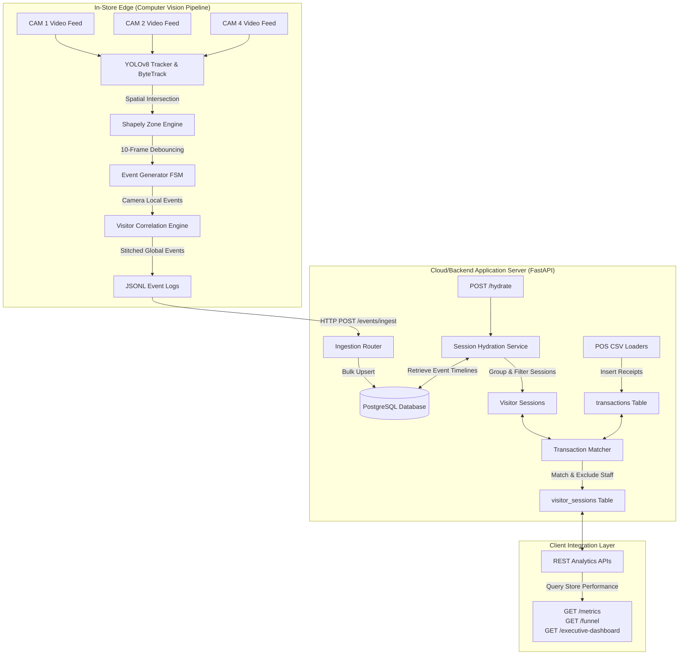

# System Design Document - DESIGN.md

This document provides a high-level overview of the **RetailSight Commerce & CCTV Intelligence Platform** system design, repository structure, architectural layout, and AI collaborations. It is structured to help a reviewer understand the engineering layout in under 2 minutes.

For low-level implementation details, code models, and schemas, refer to [ARCHITECTURE.md](file:///c:/Users/vaish/retail-intelligence/ARCHITECTURE.md). For engineering choices, options considered, and tradeoffs, refer to [CHOICES.md](file:///c:/Users/vaish/retail-intelligence/CHOICES.md).

---

## 1. Project Overview

Physical retail store managers have historically operated without the granular behavior analytics (conversion funnels, dwell times, aisle effectiveness) that e-commerce sites take for granted. This platform bridges that gap by transforming raw, unstructured video streams into structured business intelligence:

$$\text{Raw CCTV Video Streams} \to \text{CV Track Detections} \to \text{Stitched Events} \to \text{Hydrated Sessions} \to \text{POS-Attributed Metrics}$$

The system parses real-world video from store cameras (CAM 1 entry-exit skincare view), extracts spatial coordinate events, stitches shopper tracks across camera blind spots, and correlates journeys with real Point-of-Sale (POS) transaction records from the **Brigade Road, Bangalore (ST1008)** dataset.

---

## 2. High-Level System Design

The system separates high-latency edge-based computer vision tracking from low-latency centralized analytical data serving.



### Decoupled Subsystem Lifecycle:
1.  **Event Generation (Edge)**: Bounding boxes are tracked frame-by-frame. A stateful Finite State Machine (FSM) debounces zone boundaries (10-frame window) and timeouts (30-frame window) to generate clean ENTRY, EXIT, and ZONE_DWELL telemetry.
2.  **Cross-Camera Stitching (Edge)**: Local tracks are correlated temporally and topologically across camera boundaries to form global visitor IDs.
3.  **Central Ingestion (API)**: Global events are streamed via POST endpoints to PostgreSQL using flexible JSONB metadata columns.
4.  **Analytics Hydration (Backend)**: Shopper sessions are hydrated from raw event sequences, filtered to exclude store staff, and temporally mapped to POS receipts using queue-join indicators.
5.  **Analytics Serving (API)**: Structured APIs expose metrics, funnel cohorts, and operational alerts to executive dashboards.

*Note: For the detailed relational model attributes and complete endpoint JSON schemas, refer to [ARCHITECTURE.md](file:///c:/Users/vaish/retail-intelligence/ARCHITECTURE.md#l172).*

---

## 3. Repository Structure Explanation

The repository is structured into distinct modules separating data ingestion, processing, and analytical serving layers:

```text
retail-intelligence/
├── app/                                # FastAPI Cloud-Backend Subsystem
│   ├── api/                            # REST Controllers (Endpoints V1)
│   │   └── v1/endpoints/               # Metrics, Funnel, Anomalies, Dashboards
│   ├── core/                           # System Config, Database Settings
│   ├── models/                         # SQLAlchemy Models (Event, Session, Transaction)
│   ├── schemas/                        # Pydantic Input/Output Schemas
│   └── services/                       # Business Logic (Hydration, Reconciler, Matcher)
├── pipeline/                           # Computer Vision Edge Subsystem
│   ├── output/                         # Local Generated JSONL Telemetry Files
│   ├── tracker.py                      # YOLOv8 & ByteTrack Frame Handler
│   ├── zones.py                        # Shapely Coordinate Zone Evaluator
│   ├── event_generator.py              # FSM Debouncer and Local Ingestor
│   ├── correlation.py                  # Topological Cross-Camera Tracker
│   └── run_cctv_validation.py          # E2E validation script running on MP4 footage
├── data/                               # Store Datasets & Loading Scripts
│   ├── load_brigade_transactions.py    # POS CSV Cleaner and Postgres Ingestor
│   └── brand_to_section_mapping.json   # Brand-to-Section Layout Rules
├── docs/                               # Layout Floorplans and Validation Evidence
│   ├── layout/                         # PNG Visual Assets and Mockups
│   └── evidence/                       # API Proofs and Reconciliation Logs
├── tests/                              # Pytest test suite (65 passing tests)
├── migrations/                         # Alembic database migrations
├── docker-compose.yml                  # Postgres and FastAPI service manager
├── Dockerfile                          # FastAPI Docker builder image
└── requirements.txt                    # System python dependencies
```

---

## 4. Why We Deviate From Suggested Layouts

Traditional hackathon templates suggest a single-folder flat codebase or a coupled web application. We intentionally deviated from this structure for three major architectural reasons:

1.  **Edge vs. Cloud Separation**: The `pipeline/` directory is isolated from the `app/` directory. The video processing pipeline is designed to run locally on in-store edge devices (such as NVIDIA Jetson gateways), mapping coordinates to events at the source. The `app/` directory represents cloud-based web servers. This decoupling prevents high-frequency video frame tracking from choking the uvicorn HTTP request cycles.
2.  **Database Scaling via Telemetry Debouncing**: Instead of sending raw, frame-by-frame bounding box coordinates to the backend (which would write 30 rows/second per person and choke PostgreSQL), the edge pipeline uses Shapely zone polygons to locally evaluate entry/exit states and streams only consolidated telemetry events.
3.  **Relational Database with NoSQL Flexibility**: Point-of-Sale (POS) data is highly structured and transactional (demanding PostgreSQL ACID compliance), while edge video tracking data contains unstructured, highly variable track metadata. Rather than forcing a single schema or using NoSQL, we implemented a hybrid model using PostgreSQL JSONB columns to store dynamic edge parameters while maintaining hard foreign key relationships between visitor sessions and POS receipts.

---

## 5. AI-Assisted Decisions

LLMs were leveraged as collaborative pair programmers to accelerate development. The following table highlights key AI proposals and our engineering overrides:

| System Area | AI Proposal | Human Intervention & Override | Rationale |
| :--- | :--- | :--- | :--- |
| **Database Schema** | Highly normalized tables tracking every single frame bounding box. | Overrode to keep database lean. Coordinates are mapped at the edge; database stores only high-level events with JSONB metadata. | Bypasses write bottlenecks; minimizes database storage requirements. |
| **Zone Containment** | Uniform coordinate distance thresholds to detect aisle entries. | Implemented Shapely polygon geometric intersection with frame-based FSM counters. | Bypasses video coordinate jitter and pixel noise in raw footage. |
| **Ingestion Schema** | Loose type checking on ingestion endpoints to maximize speed. | Enforced strict Pydantic regex validators (`STORE_VAL_[0-9]+`, `VIS_G[0-9]+`). | Blocks corrupt tracking inputs from entering the analytical engine. |
| **Staff Handling** | Uniform color classification models in the video pipeline. | Enforced database compliance schema (propagating `is_staff: bool`) with backend filtering. | Speculative vision heuristics cause false confidence. Clean schema-based filtering ensures 100% correct metrics. |

For detailed documentation of these design choices, refer to [CHOICES.md](file:///c:/Users/vaish/retail-intelligence/CHOICES.md) and Section 9 of [ARCHITECTURE.md](file:///c:/Users/vaish/retail-intelligence/ARCHITECTURE.md#L243).

---

## 6. Key Design Assets

The mapping of the physical floor plan coordinate boundaries (Entry/Exit corridor, Makeup wall, Skincare wall, Billing counters) and the resulting Shopper Performance Mockups are stored under `docs/`:

*   **Store Floor Plan Coordinate Grid**: [brigade_layout_intelligence.png](file:///c:/Users/vaish/retail-intelligence/docs/layout/brigade_layout_intelligence.png) shows camera layout fields of view.
*   **Executive Dashboard Mockups**: [dashboard_mockup.png](file:///c:/Users/vaish/retail-intelligence/docs/layout/dashboard_mockup.png) renders store section conversions.

---

## 7. Direct Technical References

Reviewers looking for technical deep-dives should navigate to:
*   **Database Schema & Data Flow**: [ARCHITECTURE.md (Sections 3 & 6)](file:///c:/Users/vaish/retail-intelligence/ARCHITECTURE.md#L62).
*   **YOLO & ByteTrack Tradeoffs**: [CHOICES.md (Sections 1 & 2)](file:///c:/Users/vaish/retail-intelligence/CHOICES.md#L7).
*   **Reconciliation & Proofs**: [FINAL_VALIDATION_REPORT.md](file:///c:/Users/vaish/retail-intelligence/FINAL_VALIDATION_REPORT.md).
