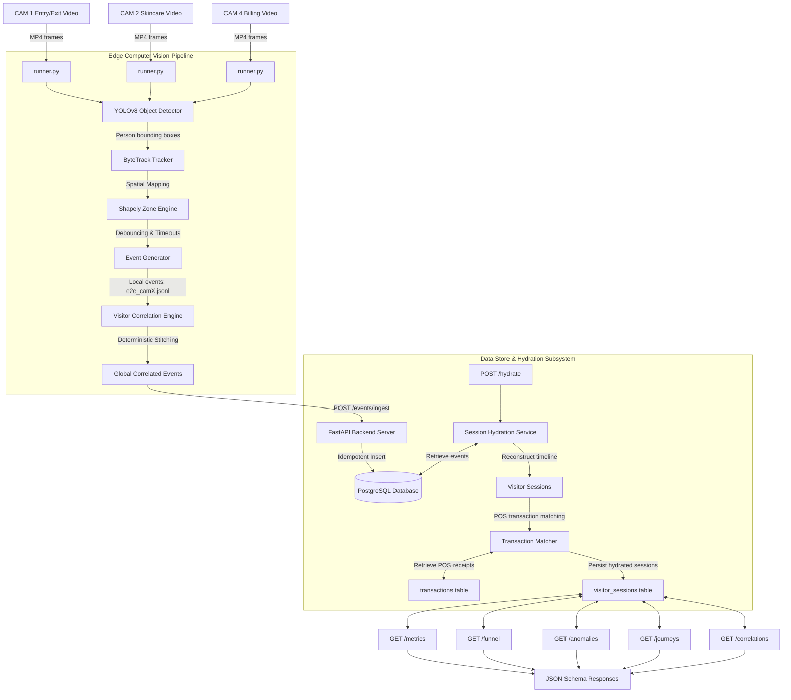

# System Design Document - Retail Intelligence Platform

This document describes the design and system architecture of the **Retail Intelligence Platform**, a telemetry and analytics engine that converts raw multi-camera CCTV streams into structured customer sessions and POS-linked metrics.

---

## 1. Problem Statement

Physical retail stores lack the rich behavioral analytics (such as conversion funnels, dwell times, and bounce rates) available to online e-commerce platforms. 
This platform bridges that gap by transforming raw, unstructured video streams into structured business intelligence:
$$\text{Raw CCTV Video Streams} \to \text{CV Track Detections} \to \text{Stitched Events} \to \text{Hydrated Sessions} \to \text{POS-Attributed Metrics}$$

Key challenges addressed:
* **Session Fragmentation**: A single visitor triggers multiple local tracking IDs as they move out of view of one camera and enter another.
* **Transaction Linking**: Point-of-Sale (POS) purchases must be correlated back to physical store journeys without personal identifiers (PII).
* **Operational Anomalies**: Real-time identification of queue spikes, sudden conversion drops, and retail zone inactivity.

---

## 2. System Architecture

The architecture separates edge-based computer vision event extraction from backend database hydration and REST API serving.

---

## 3. Data Flow Lifecycle

1. **Detection & Tracking**: A visitor is detected by YOLOv8 on `CAM1` and assigned a local track ID. Bounding boxes are tracked frame-to-frame.
2. **Spatial Mapping**: The `ZoneEngine` maps the bottom-center of the visitor's bounding box onto Shapely polygon coordinates.
3. **Event Extraction**: An `ENTRY` event is emitted. The system debounces the track across zone boundaries (requires 10 consecutive frames inside a polygon). When track loss occurs for 30 consecutive frames, an `EXIT` event is emitted.
4. **Stitching (Cross-Camera Correlation)**: Raw camera-local files are combined. The `VisitorCorrelationEngine` matches the exit on `CAM1` to an enter on `CAM2` within 30 seconds, maintaining a global identifier (e.g. `VIS_G001`).
5. **Ingestion**: Stitched events are POSTed to `/events/ingest` and written to the database. The original camera and track IDs are stored in a JSONB `metadata` column.
6. **Hydration**: The `SessionHydrationService` groups database events by global visitor ID, calculates dwell times, and creates a `VisitorSession` record.
7. **Attribution**: The `TransactionMatcher` evaluates proximity between checkout queue enter/dwell times and POS transactions, linking the `transaction_id` to the session.
8. **Serving**: API endpoints query the sessions and transactions tables to compute metrics, conversion rates, and anomalies.

---

## 4. Database Design

The schema is built for PostgreSQL using SQLAlchemy. 

### A. `Event` Model (`events` table)
Stores the raw, atomic signals emitted by cameras.
* `event_id` (UUID, Primary Key, Indexed)
* `store_id` (String(50), Indexed, Non-Nullable)
* `camera_id` (String(100), Nullable)
* `visitor_id` (String(50), Indexed, Nullable) - Stores the stitched global ID (e.g., `VIS_G001`).
* `event_type` (Enum: ENTRY, EXIT, ZONE_ENTER, ZONE_EXIT, ZONE_DWELL, BILLING_QUEUE_JOIN, BILLING_QUEUE_EXIT)
* `timestamp` (DateTime with Timezone, Indexed, Non-Nullable)
* `zone_id` (String(100), Indexed, Nullable)
* `dwell_ms` (Integer, Nullable)
* `is_staff` (Boolean, Default False)
* `confidence` (Float, Default 1.0)
* `metadata` (JSONB, Nullable) - Stores original camera tracking metadata (`original_track_id`, `original_camera_id`, `correlation_confidence`).

### B. `VisitorSession` Model (`visitor_sessions` table)
Aggregates events into single continuous visits.
* `session_id` (UUID, Primary Key, Indexed)
* `visitor_id` (String(50), Indexed, Non-Nullable)
* `store_id` (String(50), Indexed, Non-Nullable)
* `entered_at` (DateTime with Timezone, Indexed, Non-Nullable)
* `exited_at` (DateTime with Timezone, Nullable)
* `journey_path` (JSONB) - Chronological list of zones visited (e.g. `["SKINCARE"]`).
* `zone_dwell_times` (JSONB) - Dwell time map per zone.
* `zone_transitions` (JSONB) - Transitions mapped between zones.
* `is_staff` (Boolean, Default False)
* `has_converted` (Boolean, Default False)
* `has_joined_billing_queue` (Boolean, Default False)
* `associated_txn_id` (String(100), ForeignKey to `Transaction`, Nullable)
* `intent_score` (Float, Nullable)

### C. `Transaction` Model (`transactions` table)
Point-of-Sale cash-register logs.
* `transaction_id` (String(100), Primary Key, Indexed)
* `session_id` (UUID, ForeignKey to `VisitorSession`, Nullable)
* `store_id` (String(50), Indexed, Non-Nullable)
* `timestamp` (DateTime with Timezone, Indexed, Non-Nullable)
* `total_amount` (Numeric(10, 2), Non-Nullable)
* `payment_method` (String(50), Nullable)
* `items` (JSONB, Nullable) - List of SKUs, pricing, and quantities.

---

## 5. API Design

### A. Events Ingestion
* **`POST /api/v1/events/ingest`**
  * *Request Body*: `EventBatchIngestRequest` containing list of events.
  * *Headers*: Optional `X-Idempotency-Key` to avoid double-writing retried requests.
  * *Response*: `EventBatchIngestResponse` (`ingested_count`, `duplicate_count`, `failed_count`, `errors`).

### B. Session Hydration
* **`POST /api/v1/stores/{store_id}/hydrate`**
  * *Response*: `{'hydrated_count': int, 'linked_count': int}`

### C. Store Metrics
* **`GET /api/v1/stores/{store_id}/metrics`**
  * *Query Filters*: `start_time` (datetime), `end_time` (datetime)
  * *Response*: `StoreMetrics` (visitors, engaged_visitors, billing_queue_visitors, purchases, conversion_rate, avg_session_dwell_ms, avg_journey_length, avg_zones_visited).

### D. Conversion Funnel
* **`GET /api/v1/stores/{store_id}/funnel`**
  * *Response*: `FunnelReport` containing cohort counts and progression percentages for `Store Entry` $\to$ `Browsing Zones` $\to$ `Checkout Counter` $\to$ `Completed Purchase`.

### E. Anomalies Engine
* **`GET /api/v1/stores/{store_id}/anomalies`**
  * *Response*: List of `AnomalyResponse` objects representing:
    * `QUEUE_WAIT_SPIKE`: Checkout wait time exceed threshold.
    * `CONVERSION_DROP`: Conversion drops significantly below historical store average.
    * `DEAD_ZONE_ALERT`: Specific retail zone has zero active dwell time over the time window.

### F. Diagnostics & Auditing
* **`GET /api/v1/stores/{store_id}/transaction-matches`**: Diagnostic score details for transactions.
* **`GET /api/v1/stores/{store_id}/journeys`**: Journey audits (longest journeys, failed checkouts, direct purchases, entry-exit only).
* **`GET /api/v1/stores/{store_id}/correlations`**: Track correlation diagnostics (global ID to original track ID mappings, confidence ratings, and statistics).
* **`GET /api/v1/stores/{store_id}/insights/revenue`**: Revenue KPIs (Total NMV, GMV, ABV, temporal trends).
* **`GET /api/v1/stores/{store_id}/insights/products`**: Product metrics (top products, brands, categories by revenue).
* **`GET /api/v1/stores/{store_id}/insights/offers`**: Offer conversion contribution and usage statistics.
* **`GET /api/v1/stores/{store_id}/insights/salespeople`**: Salesperson NMV contribution and order counts.
* **`GET /api/v1/stores/{store_id}/executive-summary`**: High-level store operations executive dashboard data.

---

## 6. Business Insights Engine & Journey Commerce

To convert raw spatial-temporal CCTV telemetry into actionable commercial insights, the platform incorporates a **Business Insights Engine** that processes the **real Brigade Road, Bangalore transaction dataset**.

### A. Retail Insights Service (`RetailInsightsService`)
Parses the itemized Brigade transactions dynamically to compute standard retail metrics:
- **Revenue KPIs**: Total Net Merchandise Value (NMV), Gross Merchandise Value (GMV), Applied Discounts, Average Basket Value (ABV), and temporal (hourly/daily) revenue peaks.
- **Product KPIs**: Rankings for top selling products, brands (e.g. Faces Canada as anchor brand), categories, and subcategories.
- **Offer KPIs**: Evaluates offer performance (count, NMV) and determines the exact conversion contribution percentage of each marketing campaign.
- **Employee KPIs**: Tracks salesperson performance by revenue and volume to rank top performing staff members (e.g., Zufishan Khazra).

### B. Journey Commerce Service (`JourneyCommerceService`)
Stitches in-store visitor paths (CCTV) with checkout receipts (POS) to model physical-commercial correlation:
- **Dwell $\to$ Purchase Correlation**: Determines the purchase likelihood curve of visitors depending on how long they spent inside a specific zone (e.g., Skincare visitors spending > 1 minute convert at 75%).
- **Zone Effectiveness**: Evaluates physical regions against actual checkouts to identify the commercial value of each square foot.
- **Checkout Bottlenecks**: Audits billing queue abandonment rate and calculates potential lost revenue at register counters.
- **Opportunity Zones**: Highlights physical zones with high average dwell times but low transaction conversion rates (e.g., Skincare) representing major opportunity loss.

---

## 7. Correlation Architecture

Cross-camera correlation maps disjointed camera-local tracking paths (e.g. `CAM1_TRACK_65` $\to$ `CAM2_TRACK_1` $\to$ `CAM4_TRACK_2`) into a single global visitor ID `VIS_G017`.

### Heuristic Approach Selection
We chose **deterministic heuristics** instead of deep-learning Re-ID models (like OSNet or Torchreid) for the MVP:
1. **Explainable Rules**: Deterministic rules (e.g., transition between exit CAM1 and enter CAM2 must be within 30s) are highly auditable and explainable.
2. **Computational Speed**: Processing track records with temporal constraints runs in milliseconds, compared to running inference on deep Re-ID embedding vectors.
3. **No Hardware Prerequisites**: The engine runs on CPU, removing the need for GPU server nodes at the store edge.

---

## 8. Scaling Considerations

* **Kafka Streaming Ingestion**: Real-time deployments will replace `POST /events/ingest` with a Kafka topic (e.g. `store-events`). Edge cameras publish events directly to the stream.
* **Partitioned Repositories**: The database models can be partitioned by `store_id` to distribute write loads across database clusters.
* **Horizontal Scaling**: Since the FastAPI backend is completely stateless (session hydration reads and writes directly to PostgreSQL), the API container can scale horizontally behind a load balancer (e.g. Nginx).

---

## 9. Limitations & Future Work

* **Current Limitation (Heuristics)**: Cross-camera correlation uses temporal and topological heuristics. While robust under clear, sequential store flows, it is prone to confusion under extremely high density (crowds).
  * *Future Work*: Integrate DeepSORT Re-ID or OSNet embedding features to resolve track associations when multiple candidate matches fall into the same temporal window.
* **Current Limitation (Transaction Matching)**: POS transaction matching relies on temporal correlation (linking a transaction shortly after a visitor enters the checkout queue). It cannot perfectly distinguish visitors checkout order if queue exits occur in rapid succession.
  * *Future Work*: Integrate cashier POS terminal camera synchronization (detecting the exact moment a specific customer is in front of the scanner) to anchor the matching algorithm.
* **Current Limitation (Anomalies)**: Operational anomalies (like conversion drops) rely on static, configurable thresholds.
  * *Future Work*: Implement adaptive, seasonal anomaly baseline algorithms that learn the store's typical traffic curves depending on the day of the week, holidays, and times of day.

