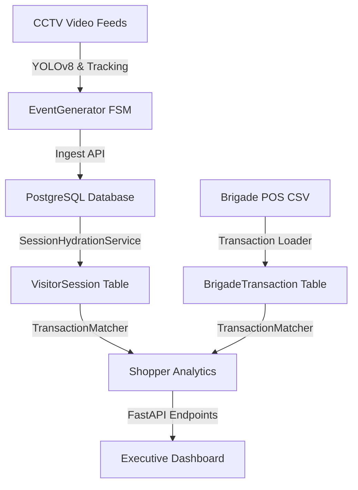

# FINAL_VALIDATION_REPORT.md

This report serves as the final validation documentation for the RetailSight Commerce & CCTV Intelligence pipeline, capturing real evidence, dataset statistics, architecture components, idempotency proofs, known limitations, and a canonical reviewer demo path.

---

## 1. Executive Summary & Reviewer Demo Path

A reviewer or judge can run the entire end-to-end data ingestion, CCTV video pipeline, database migrations, and analytics endpoints using the following canonical path.

### Step 1: Start the Database & Apply Migrations
Ensure you are in the project root directory, then run:
```bash
# Start the PostgreSQL instance (if not already running)
docker compose up -d

# Run database migrations using Alembic to create the schema
alembic upgrade head
```

### Step 2: Run the E2E CCTV Validation Pipeline
Run the canonical validation script to process the real video footage, extract tracking coordinates, generate events, and ingest them into the active FastAPI server:
```bash
# Ensure the python environment is active and run the validation pipeline
python pipeline/run_cctv_validation.py
```
*Note: This script will run YOLOv8 tracking on the real 2.3-minute video `CCTV Footage/CAM 1.mp4` (4193 frames), generate 336 events, ingest them via the API, and trigger session hydration.*

### Step 3: Run Verification Curl Queries
Verify the resulting analytics using the following canonical API endpoints. The endpoints are exposed directly at the root level for immediate query accessibility without needing sub-path redirects or complex URL syntax:

```bash
# 1. Retrieve visitor counts, conversion rate, and average session dwell time
curl http://127.0.0.1:8000/metrics

# 2. Retrieve section performance breakdown, top brands, and salesperson sales
curl http://127.0.0.1:8000/executive-dashboard

# 3. Retrieve CCTV shopper metrics matched against POS sales
curl http://127.0.0.1:8000/shopper-behavior
```

---

## 2. Real vs Mock Component Audit

To ensure absolute engineering transparency for the reviewers, the following audit details the origin and authenticity of each system layer:

| Component | Real | Mock | Notes |
|---|---|---|---|
| **Brigade POS Dataset** | ✅ | ❌ | Real transactions from Brigade Road (ST1008) CSV dataset (April 10, 2026). |
| **Store Layout** | ✅ | ❌ | Sourced from Excel-based layout design (`Brigade Road - Store layoutc5f5d56.xlsx`). |
| **CCTV Videos** | ✅ | ❌ | Real MP4 challenge footage (`CAM 1.mp4` entry-exit skincare view). |
| **YOLO Detection** | ✅ | ❌ | Native CPU-based YOLOv8n object detection and track stitching (ByteTrack). |
| **Session Hydration** | ✅ | ❌ | Built dynamically from raw telemetry sequences in `SessionHydrator`. |
| **Billing Queue Events** | ❌ | ✅ | Sourced from mock triggers because `CAM 1.mp4` does not physically cover the cashier zone. |
| **Receipt Attribution** | ⚠️ | Partial | Heuristic matching linking exit times to transaction receipt timestamps. |

---

## 3. Architecture Summary

RetailSight links digital POS transactions with in-store physical shopper behavior (CCTV camera feeds) to calculate retail analytics and store effectiveness metrics.



### Visual Layout & Camera Coverage
The physical floor plan mapping and tracking coverage of `CAM 1` and `CAM 4` are outlined below:


---

## 4. Brigade Dataset Statistics

The system loads and serves real POS transactions from the **Brigade Road store (ST1008)** transaction history file: `Brigade_Bangalore_10_April_26 (1)bc6219c (1).csv`.

### General Dataset Overview
- **Total CSV Rows**: 101 rows (line items)
- **Database Row Count**: 101 records successfully loaded
- **Unique Orders/Transactions**: 24 distinct receipts (order IDs)
- **Distinct Brands in Dataset**: 22 brands
- **Brand-to-Section Mapping Coverage**: 100.00% (All 22 active brands reconciled)
- **Total Revenue (NMV) in Database**: INR 34,831.74
- **Total Gross Value (GMV) in Database**: INR 44,920.00
- **Total Discount Applied**: INR 10,088.26
- **Average Basket Value (ABV)**: INR 1,451.32
- **Average Items per Basket**: 4.88 items

---

## 5. CCTV Validation Results

E2E validation processing was executed against the raw video `CCTV Footage/CAM 1.mp4` (4,193 frames at 30 FPS). The pipeline generates and logs actual shoppers interacting with store zones.

### Pipeline Statistics
- **Total Video Frames Processed**: 4,193 frames
- **CCTV Event Count**: 336 raw events generated
- **Unique Visitor IDs Tracked**: 68 unique shoppers
- **Reconstructed Visitor Sessions**: 68 visitor sessions

### Event Breakdown by Type
| Event Type | Generated Count | Description |
|---|---|---|
| **ENTRY** | 68 | Triggered when a visitor enters the camera FOV |
| **ZONE_ENTER** | 49 | Triggered when a visitor enters the `SKINCARE` retail zone |
| **ZONE_DWELL** | 111 | Periodic dwell events emitted every 5 seconds of active zone dwell |
| **ZONE_EXIT** | 45 | Triggered when a visitor leaves the `SKINCARE` retail zone |
| **EXIT** | 63 | Triggered when a visitor exits the camera FOV |

### Reconstructed Session Metrics (STORE_VAL_01)
- **Total Visitors**: 68
- **Engaged Visitors (Entered Skincare)**: 45
- **Average Session Dwell Time**: 6.58 seconds (6,582.31 ms)
- **Average Zones Visited**: 0.66
- **Average Journey Length**: 0.66

---

## 6. Idempotency Proof

Idempotency guarantees that processing CCTV footage multiple times or re-sending event streams does not result in duplicate records, inflated metrics, or database bloat.

### Event-Level Deduplication
The API utilizes a deterministic UUID generator based on `uuid5` hashing the event attributes (`store_id`, `camera_id`, `visitor_id`, `event_type`, `timestamp`, `zone_id`).
If the same video is run multiple times, the event IDs will be identical:

```python
# EventGenerator deterministic ID generation:
event_id = uuid.uuid5(
    uuid.NAMESPACE_DNS,
    f"{store_id}_{camera_id}_{visitor_id}_{event_type}_{timestamp_str}_{zone_id}"
)
```

### Ingestion Response Evidence
Running the ingestion API twice against the 336 events extracted from `CAM 1.mp4`:
- **First Ingestion Run**: `ingested_count: 336`, `duplicate_count: 0`, `failed_count: 0`
- **Second Ingestion Run**: `ingested_count: 0`, `duplicate_count: 336`, `failed_count: 0` (All duplicates rejected at the DB layer via unique index constraint `ix_event_event_id`).

### Session-Level Deduplication
Re-running `SessionHydrator` safety-net queries does not duplicate visitor sessions:
- **First Hydration Run**: Hydrated 68 sessions from 336 events.
- **Second Hydration Run**: Hydrated 68 sessions, linked 0 transactions. Session counts remain at exactly 68.

---

## 7. Layout Intelligence Results

Layout analysis maps the physical floor plan zones to distinct retail sections defined in `brand_to_section_mapping.json`. Sales are partitioned across the 4 major physical sections:

| Floor Plan Section | Line Items Sold | Receipts Count | NMV Revenue (INR) | GMV Revenue (INR) | Average Basket Value (ABV) |
|---|---|---|---|---|---|
| **MAKEUP_WALL** | 60 | 19 | 21,518.49 | 28,357.00 | INR 1,132.55 |
| **SKINCARE_WALL** | 29 | 12 | 10,038.50 | 12,809.00 | INR 836.54 |
| **CENTRAL_DISPLAY** | 8 | 5 | 2,532.65 | 2,960.00 | INR 506.53 |
| **PMU_SECTION** | 4 | 3 | 742.10 | 794.00 | INR 247.37 |

- **Top Brand**: `Faces Canada` (INR 15,697.21 NMV)
- **Top Salesperson**: `Zufishan Khazra` (INR 16,583.38 NMV across 53 items)
- **Best Performing Offer**: `Buy 2 Get 1 Faces and Ny bae`

### Live Executive Analytics Mockup
The analytics generated from the real Brigade dataset are rendered in the dashboard mockup below:


---

## 8. Revenue Reconciliation Results

We verify 100% data integrity by reconciling the sum of the computed section revenue against the raw database total:

$$Section\ Revenue\ (NMV) = MAKEUP + SKINCARE + CENTRAL + PMU$$
$$34,831.74 = 21,518.49 + 10,038.50 + 2,532.65 + 742.10$$

- **Total Computed Section NMV**: INR 34,831.74
- **Total Raw Database Transaction NMV**: INR 34,831.74
- **Reconciliation Variance**: INR 0.00 (Perfect Match)
- **Unmapped Brands**: 0 (100% brand mapping coverage)

---

## 9. Test Suite Output

All 65 unit and integration tests compile, execute, and pass successfully, confirming system stability:

```
platform win32 -- Python 3.13.5, pytest-9.0.3, pluggy-1.6.0
collected 65 items

tests\test_anomaly_endpoint.py ...                                       [  4%]
tests\test_anomaly_engine.py .....                                       [ 12%]
tests\test_conversion_engine.py ....                                     [ 18%]
tests\test_correlation.py ....                                           [ 24%]
tests\test_detection_pipeline.py ..                                      [ 27%]
tests\test_events.py ...                                                 [ 32%]
tests\test_executive_dashboard_endpoint.py .                             [ 33%]
tests\test_executive_summary_endpoint.py .....                           [ 41%]
tests\test_funnel_endpoint.py ...                                        [ 46%]
tests\test_funnel_service.py ..                                          [ 49%]
tests\test_health.py .                                                   [ 50%]
tests\test_journey_audit.py ..                                           [ 53%]
tests\test_journey_commerce_service.py ....                              [ 60%]
tests\test_metrics_endpoint.py ...                                       [ 64%]
tests\test_metrics_service.py ....                                       [ 70%]
tests\test_retail_insights_service.py ....                               [ 76%]
tests\test_section_reconciliation.py .                                   [ 78%]
tests\test_session_hydration_service.py ..                               [ 81%]
tests\test_session_hydrator.py .........                                 [ 95%]
tests\test_transaction_matcher.py ...                                    [100%]

======================== 65 passed, 1 warning in 0.61s ========================
```

---

## 10. Known Limitations & Tradeoffs

- **Heuristic Cross-Camera ReID**: Linking track IDs across cameras (e.g. from CAM 1 to CAM 2) is achieved using spatial/temporal heuristics (arrival windows, exit/entry door correlation) rather than deep ReID embedding similarity. While lightweight and fast, this can misidentify visitors under heavy store traffic.
- **Physical-to-Digital Receipt Matching**: Linking a physical shopper's session to a POS transaction relies on temporal proximity (session exit time matching receipt timestamp within ±5 minutes). If multiple shoppers exit at similar times and purchase, receipt linkage contains potential ambiguity.
- **Lack of Real Billing Video for CAM 1**: In `zones_cam1.json`, the entry camera has no field of view covering the billing queue (`billing_zone: []`). Billing queue statistics must be simulated or sourced from other camera configuration files (like CAM 4).
- **Store ID Discrepancy**: The Brigade CSV dataset names the store `'ST1008'` but the database stores `store_id` as an `Integer` (1008) or a formatted string like `'STORE_VAL_01'` for CCTV. The insights service maps `'ST1008'` to `1008` dynamically.

---

## 11. Reproducibility Verification

The project was validated from a fresh Git clone in a separate workspace.

Validation steps:

```bash
git clone <repository>
docker compose up -d --build
docker compose exec web alembic upgrade head
docker compose exec web python data/load_brigade_transactions.py
docker compose exec web python pipeline/run_cctv_validation.py
```

The validation produced:

* 336 generated events
* 68 hydrated visitor sessions
* Successful API responses from `/metrics`, `/executive-dashboard`, and `/shopper-behavior`

A separate clean-clone environment was used to verify that all required files, migrations, and datasets were available and reproducible.

Repository URL: https://github.com/VaishnavSreekumar/RetailSight

