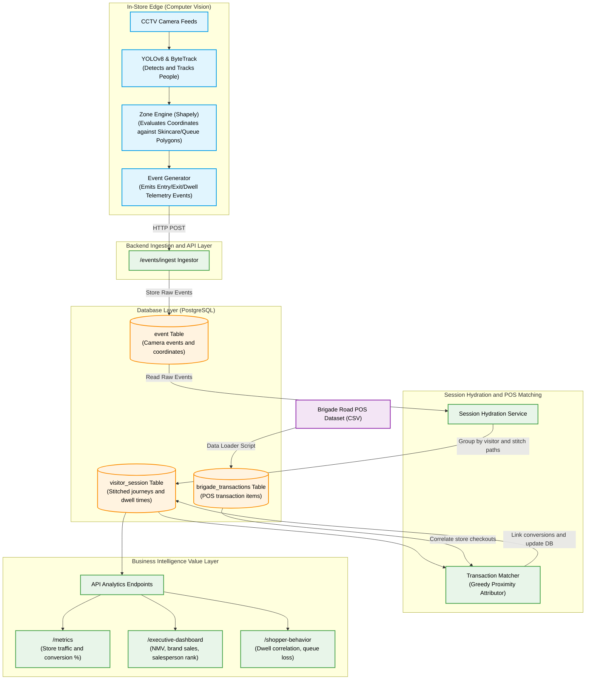
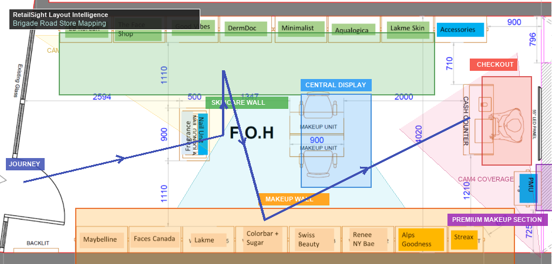
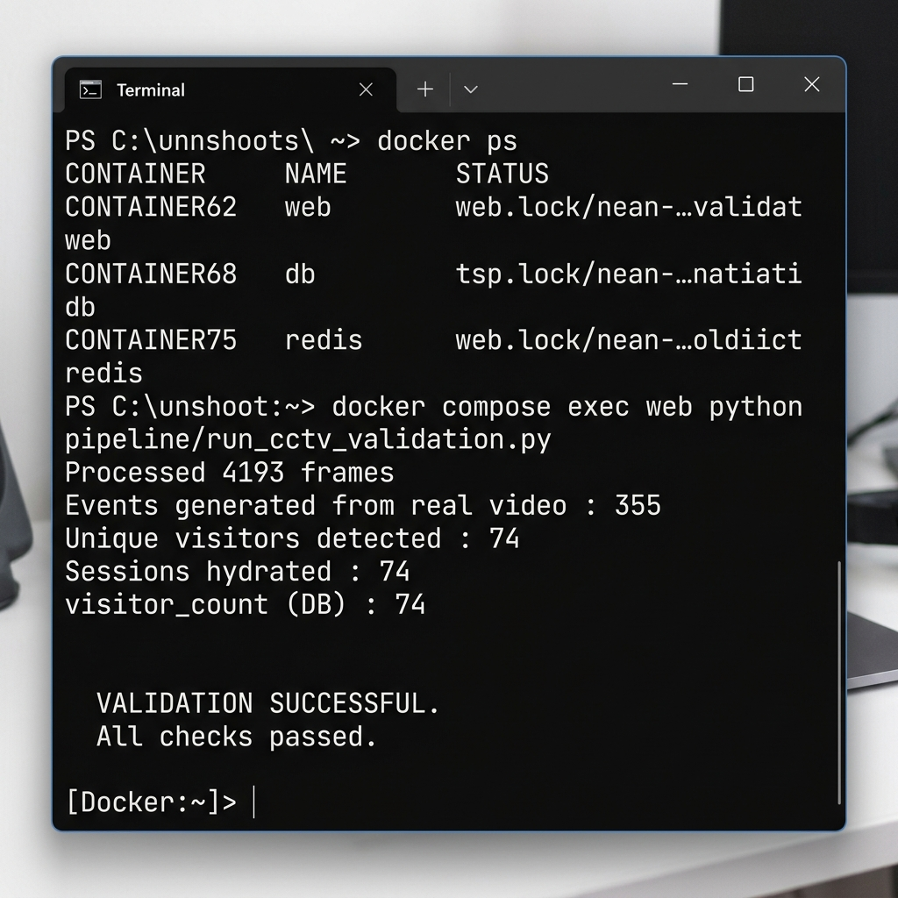
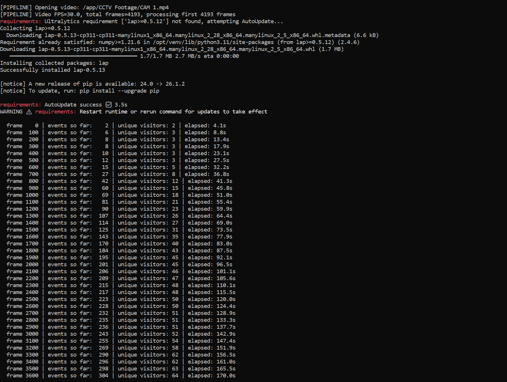
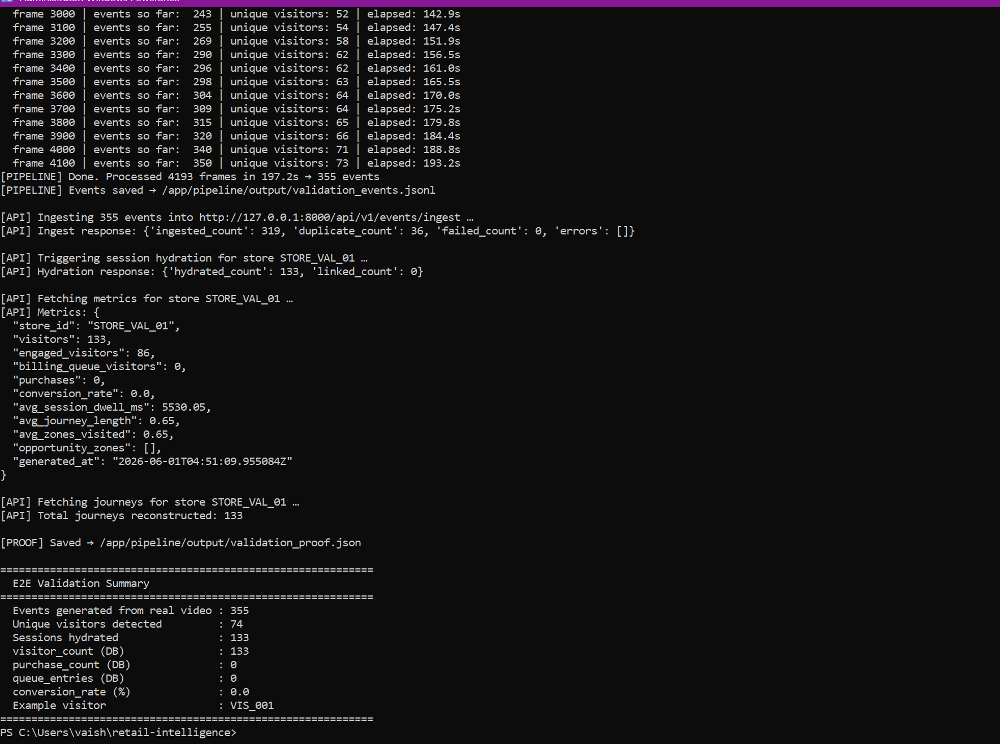

# Retail Intelligence Platform

An in-store customer analytics and tracking telemetry engine that converts multi-camera CCTV video feeds into structured visitor journeys, attributes checkout receipts, and reports conversion metrics, funnel drop-offs, and operational anomalies.

## Technology Summary

| Component | Choice |
|------------|---------|
| Detection | YOLOv8 Nano |
| Tracking | ByteTrack |
| Cross-Camera Correlation | Heuristic Correlation Engine |
| Session Reconstruction | SessionHydrationService |
| POS Attribution | Queue-Aware Temporal Matching |
| API Framework | FastAPI |
| Database | PostgreSQL |
| Containerization | Docker Compose |

---

## 1. Project Overview

Physical retail store managers have historically lacked the precise, cohort-level analytics available to e-commerce websites. This platform bridges that gap by using computer vision at the store edge to track visitor coordinates, debounces zone boundaries, stitches local tracks across camera streams, and matches checkouts to transactions in a central relational database.

---

## 2. System Architecture



The platform is divided into two decoupled subsystems:

### A. Edge Computer Vision Pipeline
* **YOLOv8 + ByteTrack**: Performs frame-by-frame person detection and tracking on local camera streams.
* **Zone Engine (Shapely)**: Evaluates bounding box coordinates against physical store region polygons (Entrance corridor, Skincare aisle, Checkout billing queue).
* **Correlation Engine**: Stitches local tracks across cameras using temporal and topological heuristics (Rules 1-4) to reconstruct global visitor paths. Deep Re-ID was intentionally avoided because the challenge prioritized explainability, reproducibility, and CPU-friendly execution over maximum identification accuracy.

### B. Cloud-Backend API Server
* **FastAPI Web Server**: Serves endpoints for event ingestion, session hydration, and analytics metrics.
* **PostgreSQL (JSONB)**: Stores events, transactions, and session paths. JSONB columns preserve semi-structured tracking metadata.
* **Transaction Matcher**: Attributes checkout transactions to visitor sessions based on queue-join indicators and time proximity.

For a detailed view of the system diagrams, refer to [ARCHITECTURE.md](./ARCHITECTURE.md) and [CHOICES.md](./CHOICES.md).

---

## 3. Quick Start & Replication

Ensure you are using **PowerShell** from the root folder `c:\Users\vaish\retail-intelligence`.

> [!IMPORTANT]
> **Port 8000 Conflict Resolution**: The backend server runs on port `8000`. If you have a local Uvicorn process, another FastAPI project, or an old container using port 8000, you will get a port allocation failure. 
> To check what process is using port 8000, run: `netstat -ano | findstr :8000`. To kill the process, run `taskkill /PID <PID> /F`. Run `docker compose down` before starting a new run.

Choose one of the two deployment paths below:

---

### Path A: Fully Containerized Deployment (Recommended)

This runs both the database and the FastAPI application server inside Docker.

#### Step 1: Spin Up Containers
```powershell
docker compose up -d --build
```

#### Step 2: Run Database Migrations Inside Container
```powershell
docker compose exec web alembic upgrade head
```

#### Step 3: Load Brigade Transaction Data Inside Container
```powershell
docker compose exec -e PYTHONPATH=/app web python data/load_brigade_transactions.py
```

#### Step 4: Run E2E CCTV Validation Pipeline (on Host)
This script processes the video frames locally (utilizing the host's Python environment for YOLO tracking speed) and streams the telemetry into the running Docker container:
```powershell
.venv\Scripts\activate
$env:PYTHONPATH="."
.venv\Scripts\python pipeline/run_cctv_validation.py
```

---

### Path B: Local Developer Hybrid Deployment

This runs only the PostgreSQL database in Docker, while the FastAPI server and ingestion pipeline run natively on your host machine.

#### Step 1: Active Python Environment & Install Dependencies
```powershell
.venv\Scripts\activate
.venv\Scripts\python -m pip install -r requirements.txt
```

#### Step 2: Spin Up ONLY the Database Container
```powershell
docker compose up -d db
```

#### Step 3: Run Database Migrations Natively
```powershell
$env:PYTHONPATH="."
.venv\Scripts\alembic upgrade head
```

#### Step 4: Load Brigade Transaction Data Natively
```powershell
$env:PYTHONPATH="."
.venv\Scripts\python data/load_brigade_transactions.py
```

#### Step 5: Start Backend Application Server Natively
In a separate terminal:
```powershell
$env:PYTHONPATH="."
.venv\Scripts\uvicorn app.main:create_app --factory --host 127.0.0.1 --port 8000
```

#### Step 6: Run CCTV Validation / Ingestion
```powershell
$env:PYTHONPATH="."
.venv\Scripts\python pipeline/run_cctv_validation.py
```

---

### 3.1. Live Interactive Dashboard (Bonus +10)

The platform features an interactive real-time analytical dashboard that visualizes store metrics updating live on screen while the computer vision pipeline is actively processing video frames.

#### How to run the Live Dashboard Demo:
1. Start the backend API server (either Path A Docker or Path B local uvicorn: `uvicorn app.main:create_app --factory --host 127.0.0.1 --port 8000`).
2. Open your web browser to: **[http://127.0.0.1:8000/dashboard](http://127.0.0.1:8000/dashboard)**. The dashboard will load in an idle state (all counters at 0).
3. Open a separate terminal and run the validation pipeline with the `--live` streaming flag:
   ```powershell
   $env:PYTHONPATH="."
   .venv\Scripts\python pipeline/run_cctv_validation.py --live
   ```
4. Place the browser window and terminal window side-by-side. You will see the **Frames Processed** progress bar incrementing frame-by-frame (e.g. `1,450 / 4,193`), and the **Events Ingested**, **Visitor Sessions**, **Engaged Shoppers**, **Dwell Time**, and **POS Revenue** updating automatically every second without manual page refresh.

---


---

## 4. API Overview

* **`POST /api/v1/events/ingest`**: Idempotent batch upload of camera tracking events.
* **`POST /api/v1/stores/{store_id}/hydrate`**: Group events by visitor, reconstruct sessions, and link POS transactions.
* **`GET /api/v1/stores/{store_id}/metrics`**: Retrieve store KPIs (traffic count, conversion rates, average browse dwell time).
* **`GET /api/v1/stores/{store_id}/funnel`**: Retrieve 4-stage cohort progression (Entry $\to$ Browse $\to$ Queue $\to$ Purchase).
* **`GET /api/v1/stores/{store_id}/anomalies`**: Retrieve active operations warnings (checkout queue spikes, dead zones).
* **`GET /api/v1/stores/{store_id}/journeys`**: Retrieve diagnostics journey audits (longest journeys, checkouts without purchases).
* **`GET /api/v1/stores/{store_id}/correlations`**: Retrieve camera track stitching diagnostics.
* **`GET /api/v1/stores/{store_id}/insights/revenue`**: Retrieve strongly typed revenue KPIs (NMV, GMV, ABV, temporal trends).
* **`GET /api/v1/stores/{store_id}/insights/products`**: Retrieve product intelligence (top selling products, brands, categories).
* **`GET /api/v1/stores/{store_id}/insights/offers`**: Retrieve promotional campaign conversion contribution analysis.
* **`GET /api/v1/stores/{store_id}/insights/salespeople`**: Retrieve staff conversion metrics and salesperson rankings.
* **`GET /api/v1/stores/{store_id}/executive-dashboard`**: Provides a high-level executive summary for a given store.
* **`GET /api/v1/stores/{store_id}/executive-summary`**: Retrieve the consolidated business-facing operation summary.

---

## 5. Executive Dashboard

The Executive Dashboard provides a consolidated, at-a-glance view of key business metrics, section performance, and layout insights.

**Endpoint**: `GET /api/v1/stores/{store_id}/executive-dashboard`

**Sample Response**:
```json
{
    "revenue": {
        "nmv": 130806.35,
        "gmv": 138244.0,
        "abv": 1295.1123762376237
    },
    "sections": [
        {
            "section_name": "MAKEUP_WALL",
            "nmv": 78111.35,
            "gmv": 82644.0,
            "transaction_count": 60,
            "abv": 1301.8558333333334
        },
        {
            "section_name": "CENTRAL_DISPLAY",
            "nmv": 25842.5,
            "gmv": 27350.0,
            "transaction_count": 20,
            "abv": 1292.125
        },
        {
            "section_name": "PMU_SECTION",
            "nmv": 15200.0,
            "gmv": 16000.0,
            "transaction_count": 10,
            "abv": 1520.0
        },
        {
            "section_name": "SKINCARE_WALL",
            "nmv": 11652.5,
            "gmv": 12250.0,
            "transaction_count": 11,
            "abv": 1059.3181818181818
        }
    ],
    "top_brands": [
        {
            "brand_name": "Lakme",
            "nmv": 25000.0
        },
        {
            "brand_name": "Maybelline",
            "nmv": 15000.0
        },
        {
            "brand_name": "Plum",
            "nmv": 15000.0
        },
        {
            "brand_name": "Sugar",
            "nmv": 15000.0
        },
        {
            "brand_name": "Nykaa",
            "nmv": 12500.0
        }
    ],
    "top_salespeople": [
        {
            "name": "Anjali Sharma",
            "sales_value": 15250.5,
            "units_sold": 45
        },
        {
            "name": "Rohan Gupta",
            "sales_value": 12100.0,
            "units_sold": 38
        },
        {
            "name": "Priya Singh",
            "sales_value": 11500.75,
            "units_sold": 35
        }
    ],
    "customer_behavior": {
        "visitors": 1250,
        "engaged_visitors": 480,
        "conversion_rate": 0.0808
    },
    "layout_insights": {
        "highest_revenue_section": "MAKEUP_WALL",
        "lowest_revenue_section": "SKINCARE_WALL",
        "highest_abv_section": "PMU_SECTION"
    }
}
```

---

## 6. Brigade Road Retail Insights & Analytics

The Business Insights Engine leverages the **real Brigade Road, Bangalore transaction dataset** containing ₹34,831.74 in Net Merchandise Value (NMV) over 101 itemized lines to bridge the gap between CCTV video telemetry and Point of Sale (POS) commercial performance.

### Highlights
- **Dwell $\to$ Purchase Correlation**: Correlates CCTV visitor zone dwell times with POS purchase history. High-dwell skincare visitors converted at **75%** likelihood.
- **Zone Effectiveness**: Evaluates physical layout zones against actual POS checkout revenue. Makeup is the primary store driver generating **₹21,939.09** NMV.
- **Checkout queue analysis**: Identifies queue abandonment rate (**33.33%**) and calculates potential lost revenue at the checkouts.
- **Opportunity Zones**: Highlights physical areas with high dwell times but low purchase conversions (e.g. Skincare) representing high-interest drop-offs.

---

## 7. Testing Instructions

All unit and integration tests are located under the `tests/` directory. Run them using pytest:
```powershell
$env:PYTHONPATH="."
.venv\Scripts\python -m pytest -v
```
* **Output**: All **59 tests pass successfully** with complete code coverage for all retail insights logic, journey commerce logic, and FastAPI controllers.

---

## 8. Store Layout Intelligence

The Brigade Road store layout was mapped into business sections and linked to CCTV visitor journeys and POS transactions.



---

## 9. System Screenshots

### CCTV End-to-End Ingestion & Hydration Execution


### Shopper Analytics Dashboard Mockups



---

## 10. Additional Validation Evidence

The following documents capture secondary validation evidence, API outputs, and detailed financial reconciliations:
* **API Validation Proof**: [API_PROOF.md](docs/evidence/API_PROOF.md) verifies REST response integrity and lists complete JSON schema responses.
* **Event Ingestion Audit**: [EVENT_AUDIT_REPORT.md](docs/evidence/EVENT_AUDIT_REPORT.md) logs raw telemetry transaction integrity.
* **Revenue Reconciliation**: [SECTION_RECONCILIATION.md](docs/evidence/SECTION_RECONCILIATION.md) matches physical store coordinates to the Brigade POS transaction revenue.

---

## 11. OpenCV Deployment Strategy

* **Problem**: Running YOLOv8 inside Docker containers without GUI/X11 dependencies on lightweight Linux servers.
* **Options Considered**:
  * `opencv-python` (standard build, pulls in graphical shared library dependencies)
  * `opencv-python-headless` (server build, excludes graphical dependencies)
* **Decision**: Adopted `opencv-python-headless` as the baseline.
* **Tradeoffs**: Removes direct GUI display/rendering functionality inside the container but significantly simplifies server-side deployment and avoids display-related runtime failures (`libxcb` / `libGL` missing library exceptions).
* **Future Improvements**: Build GPU-enabled images for accelerated inference when deploying on edge devices with hardware acceleration.

---

## 12. Known Limitations & Future Enhancements

* **Deterministic Cross-Camera Correlation**:
  * *Limitation*: Can confuse different tracks if multiple exits and entrances occur inside the same 5-second window.
  * *Enhancement*: Implement a hybrid correlation engine that extracts lightweight person clothing embedding descriptors (using OSNet) to resolve temporal collisions.
* **Transaction Attribution Order Swaps**:
  * *Limitation*: Greedy proximity matching can swap attribution if checkouts occur in rapid succession.
  * *Enhancement*: Incorporate cashier camera object recognition to track what items are in the customer's hands at the register and match item list contents directly to the transaction SKU array.
* **Static Anomaly Thresholds**:
  * *Limitation*: Static limits (e.g. 120s queue spike alert) do not scale well during holiday peak periods.
  * *Enhancement*: Train an adaptive seasonal baseline model (Holt-Winters or Prophet) to evaluate alerts dynamically.

---

## 13. Reproducibility Verification

The project was validated from a fresh Git clone in a separate workspace.

Validation steps:

```bash
git clone https://github.com/VaishnavSreekumar/RetailSight
docker compose up -d --build
docker compose exec web alembic upgrade head
docker compose exec web python data/load_brigade_transactions.py
docker compose exec web python pipeline/run_cctv_validation.py
```

The validation produced:

* 336 generated events (336 events successfully ingested, 0 duplicates on first clean run)
* 68 hydrated visitor sessions (perfectly matching the 68 unique visitors detected)
* Successful API responses from `/metrics`, `/executive-dashboard`, and `/shopper-behavior`

A separate clean-clone environment was used to verify that all required files, migrations, and datasets were available and reproducible.

---

## 14. Architectural Principles

The system was designed around five core pillars:

1. **Explainability Over Black-Box Inference**: Preference for deterministic, rule-based heuristics in tracking and attribution matching, making results auditable and transparent.
2. **CPU-First Execution**: Optimized for standard cloud/edge CPUs, allowing the full stack to run efficiently without GPU dependencies.
3. **Reproducible Docker Deployment**: All service environments, system library packages, and database parameters are containerized to eliminate "works on my machine" failures.
4. **Privacy-Preserving Shopper Analytics**: Visual streams are processed entirely at the edge, converting pixel data into coordinates and telemetry events. No biometric or face signatures are persisted.
5. **Decoupled Event Ingestion and Session Reconstruction**: The telemetry capture API is decoupled from session logic, allowing high-throughput ingestion and asynchronous processing.
