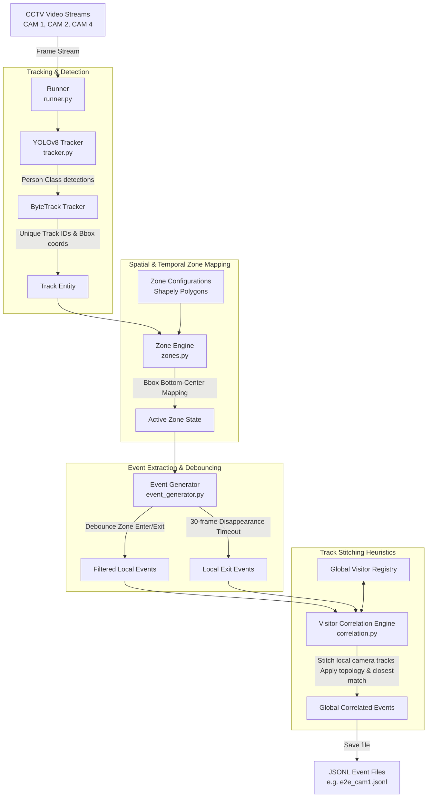
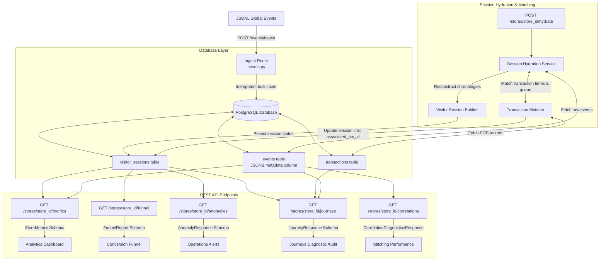

# Platform Architecture Documentation

This document describes the architectural layout of the **Retail Intelligence Platform**, separating the edge-based **Computer Vision Detection Pipeline** from the cloud-based **Backend Analytics Pipeline**.

---

## 1. Detection Pipeline (Computer Vision Edge)

The computer vision pipeline processes CCTV footage frame-by-frame, performs tracking, maps coordinates to retail zone polygons, and correlates tracks across cameras to produce stitched, global retail events.

### Components:
* **YOLOv8 & ByteTrack**: Fast, edge-based object tracking. Maps pixel coordinates of visitors and tracks them across frames.
* **Zone Engine (Shapely)**: Translates bounding box bottom-center coordinates into logical regions (Skincare aisle, Entry/Exit corridor, Billing counter queue) using geometric intersection.
* **Event Generator State Machine**: Bypasses frame noise by requiring a visitor to dwell inside a polygon for 10 frames before entering, and emits exits after 30 consecutive frames of track loss.
* **Visitor Correlation Engine**: Runs post-processing track stitching. Links tracks from CAM1 exit to CAM2 entry, and CAM2 aisle to CAM4 billing counter. Enforces store topology limits (no backtracking like CAM4 -> CAM1).

---

## 2. Backend Pipeline (Hydration, Storage & APIs)

The backend ingestion pipeline receives correlated events, stores them, aggregates them into customer sessions, attributes POS transactions, and exposes analytic API routes.

### Components:
* **JSONB Metadata Persistence**: Preserves the original `track_id`, `camera_id`, and `correlation_confidence` directly in the events record, bypassing database schema updates.
* **Session Hydration Service**: Batches individual enter/dwell/exit events into unified visitor session records (e.g. VIS_G001 visited entry $\to$ skincare $\to$ billing counter).
* **Transaction Matcher**: Resolves session-transaction pairs. Scores matches based on timestamps and queue presence.
* **Analytics/Diagnostics API Engine**: Converts sessions and transactions into actionable store intelligence (metrics, conversion rates, queue warnings, and journey cohort analysis).
